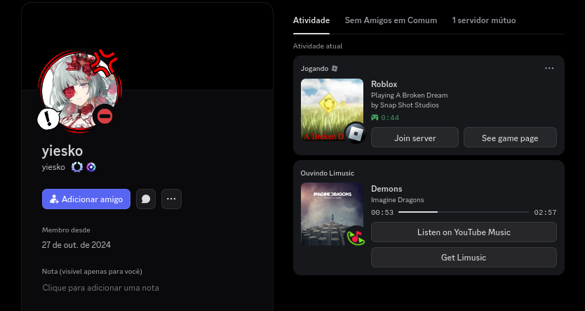
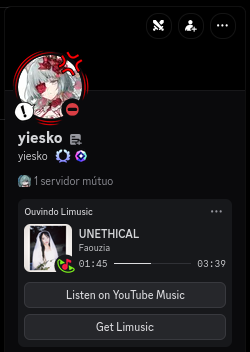

<div align=center>
  <h1>rsRPC</h1>

  <div align="center">
    
    
  </div>
  <p>Alternative Discord Rich Presence server — a CLI tool and Rust library, inspired by <a href="https://github.com/OpenAsar/arRPC">arRPC</a></p>
</div>

## What is this?

Games and apps normally show "Playing …" presence by talking to the Discord
desktop client. rsRPC is a small standalone server that accepts those
connections instead. It detects which games are running, answers game
clients with official-style replies, and forwards the presence to anything
listening on its bridge — a Vencord plugin, a browser userscript, or your
own code.

## Project status

This project is in maintenance mode. That means no new features: I am
not building new things and I am not taking feature requests. The work
going forward is making what is already here better — faster,
simpler, easier to trace and observe, and less dense inside the
crates.

Splitting the old code into many small crates made each piece easier
to follow, but it also made the whole harder to keep in your head,
and every boundary between crates is somewhere a regression can hide.
Even so, recent releases are stable and fine to use every day.

## Screenshots

Roblox (Sober) reporting its own presence over IPC, next to a Limusic
listening card — both through rsRPC at the same time:



A close-up of the listening card, with the track progress bar and its
YouTube Music buttons:



## Features

* **Game detection** — scans running processes (including Proton/Wine
  games and non-Steam shortcuts) against a game database, with Steam app-id
  lookups and sensible fallbacks for unusual launches.
* **Game-facing servers** — speaks Discord's IPC sockets and its local
  websocket protocol, so game SDKs connect as if the real client were there.
* **Web bridge** — streams presence to browser clients over JSON (port
  `1337`) and MessagePack (port `1338`).
* **Works offline** — ships with a bundled game database (24299 entries,
  11229 executables); optional hourly refresh from Discord's official
  endpoint.
* **Custom entries** — add your own games through `overrides.json` /
  `overrides.d/`, without touching the built-in database.
* **One card at a time** — a game's own presence takes over from process
  detection and hands back when it stops, so you never see two cards.
* **Self-updating** — signed releases, verified before anything runs.
* **Presence snapshots** — opt-in state files for external tooling
  (`RSRPC_STATE_FILE=1` writes `<tmpdir>/rsrpc-state-{0..9}`, arRPC
  layout).
* **Diagnostics** — `--list-detected` and `--list-database` show exactly
  what the server sees.

## Platform support

Linux is the primary platform for this fork: it is where the project is
developed and tested, where CI runs (Ubuntu, x86_64 and ARM), and where
the systemd integration and self-update mechanism live. It is
significantly more tested — and potentially more stable — here than on
macOS or Windows.

macOS and Windows builds are published as release archives and most of
the code is cross-platform, but they get far less testing: treat them
as best-effort.

Want to change that? If you'd like to help maintain Windows or macOS
support, volunteers are very welcome.

## Compatible Discord clients

Use this fork - and the original SpikeHD rsRPC it derives from - with
[Equibop](https://github.com/Equicord/Equibop),
[Vesktop](https://github.com/Vencord/Vesktop),
[Dorion](https://github.com/SpikeHD/Dorion) or
[GoofCord](https://github.com/Milkshiift/GoofCord) and never with the
official Discord client, whether installed as a Flatpak or downloaded
from Discord directly. Equibop bundles arRPC-bun, Vesktop and GoofCord
bundle arRPC, and Dorion - built by the same developer as rsRPC -
embeds rsRPC itself.

Whichever server is embedded, you can simply switch it off and let
this fork provide presence instead: each of these clients consumes
presence through a bridge on `ws://127.0.0.1:1337`, which is this
fork's default bridge port. The official client works differently: it
only ever uses its own implementation and will override this fork's
server, so running it alongside rsRPC accomplishes nothing.

## Install (Linux, systemd)

```bash
curl -fsSL https://raw.githubusercontent.com/yiesko/discord-rich-presence/main/scripts/install.sh | bash
```

The script detects your architecture, downloads the newest release binary
and unit file, verifies both against the minisign-signed checksum
manifest (minisign is required), and
installs to `~/.local/bin` and `~/.config/systemd/user`, then enables and
starts the user service. Re-running it updates. Flags: `--yes`, `--force`,
`--no-systemd` (files only), `--auto-update` (opt into background update
staging), `--binary PATH` / `--unit PATH` / `--tag TAG` (pin sources).
Uninstall with `scripts/uninstall.sh` (`--purge` also removes config and
backups). Full guide: [docs/systemd-user-units.md](docs/systemd-user-units.md).

No systemd? Download a binary from
[releases](https://github.com/yiesko/discord-rich-presence/releases) and run it directly —
the bundled game list means the server itself works fully offline.

## Quick start

```bash
./rsrpc-cli                     # run the server (Ctrl+C to stop)
./rsrpc-cli --list-detected     # show what it can see right now
./rsrpc-cli --list-database     # show database counts
./rsrpc-cli --debug             # verbose startup and logging
```

`--list-detected` runs one scan and exits, applying the same overrides and
ignore list the server would use.

## Configuration essentials

Every flag except `--yes` has an environment variable; boolean flags accept
`1`, `0`, `true`, `false`, `yes`, `no`, `on`, `off`.

| Flag | Environment variable | Default | Purpose |
|---|---|---|---|
| `-d, --detectable-file <FILE>` | `RSRPC_DETECTABLE_FILE` | bundled snapshot | Use your own game list |
| `-n, --no-process-scan` | `RSRPC_NO_PROCESS_SCAN` | off | Turn off process detection |
| `--bridge-port` / `--bridge-port-end` | `RSRPC_BRIDGE_PORT` / `RSRPC_BRIDGE_PORT_END` | `1337` / `1347` | JSON bridge port range |
| `--msgpack-port` | `RSRPC_MSGPACK_PORT` | `1338` | MessagePack bridge port |
| `--scan-interval-secs` | `RSRPC_SCAN_INTERVAL` | `5` | Process scan cadence |
| `--enable-db-update` | `RSRPC_ENABLE_DB_UPDATE` | off | Refresh the database hourly |
| `--ignore-ids <IDS>` | `RSRPC_IGNORE_IDS` | — | App ids the scanner never publishes |
| `--auto-update` | `RSRPC_AUTO_UPDATE` | off | Stage updates in the background |
| `-D, --debug` | `RSRPC_DEBUG` | off | Print configuration, raise log level |

Logs go to stderr; `RUST_LOG` overrides the log level when set. The full
reference — including ports, overrides, identity variables, and update
flags — is in [docs/cli-options.md](docs/cli-options.md).

## Known limitations

* **No OAuth / `AUTHORIZE` flow.** rsRPC can forward presence and a few
  browser commands, but it cannot complete authorization: that needs the
  real Discord client plus the app's `client_secret`, which only the game
  developer has. Games that log in over RPC need direct access to the real
  Discord client (stop rsRPC while playing them).
* **The library's `run_until` consumes the daemon.** It takes ownership of
  the database (no duplicated copies), so run one-shot diagnostics like
  `detect_once` first — the CLI's `--list-detected`/`--list-database` do
  exactly that. One-shot use never needs `run_until` at all.

## Building from source

Requirements: [Rust and Cargo](https://www.rust-lang.org/) 1.95 or newer.

```bash
git clone https://github.com/yiesko/discord-rich-presence
cd discord-rich-presence
cargo build -p rsrpc-cli --release   # → target/release/rsrpc-cli
```

The game database is committed (`crates/rsrpc-detect/resources/detectable.json`),
so a fresh clone builds without network access. Regenerate it with
`cargo run --manifest-path tools/updater/Cargo.toml`.

Tests and benchmarks:

```bash
cargo test    # unit + integration tests
cargo bench   # hash-map and JSON vs MessagePack benchmarks
```

## Using as a library

Add the dependency (git tag; `rsrpc-core` is not on crates.io):

```toml
[dependencies]
rsrpc-core = { git = "https://github.com/yiesko/discord-rich-presence", tag = "v0.36.0" }
tokio = { version = "1.53", features = ["rt-multi-thread", "macros", "signal"] }
```

Run the daemon until your own future completes:

```rust
use rsrpc_core::{Daemon, RPCConfig};

#[tokio::main]
async fn main() -> Result<(), Box<dyn std::error::Error>> {
    let daemon = Daemon::from_bundled(RPCConfig::default())?;
    daemon
        .run_until(async {
            let _ = tokio::signal::ctrl_c().await;
        })
        .await?;
    Ok(())
}
```

There are also constructors for a file (`from_file`), a JSON string
(`from_json_str`), and entries you parsed yourself (`from_parsed`), plus
one-shot `detect_once`/`database_summary` diagnostics. See
[docs/library.md](docs/library.md).

## Documentation

* [docs/cli-options.md](docs/cli-options.md) — every flag and environment variable
* [docs/process-detection.md](docs/process-detection.md) — how games are found
* [docs/protocol.md](docs/protocol.md) — handshakes, commands, and error codes
* [docs/web-client.md](docs/web-client.md) — browser, Vencord, and Node clients
* [docs/library.md](docs/library.md) — embedding the daemon in Rust
* [docs/self-update.md](docs/self-update.md) — signed self-updates
* [docs/systemd-user-units.md](docs/systemd-user-units.md) — running as a user service
* [docs/systemd-operations.md](docs/systemd-operations.md) — logs, updates, and gotchas under systemd

## Credits

* [SpikeHD / rsRPC](https://github.com/SpikeHD/rsRPC) - the original project this work builds on: SpikeHD originally developed rsRPC, and this repository continues from that foundation.
* [OpenAsar / arRPC](https://github.com/OpenAsar/arRPC) - the original project this work is inspired by. The `detectable.json` format, the executable-matching checks, and the arRPC-shaped bridge behavior (replies, websocket protocol) follow its design.
* [pog5 / rsrpc](https://github.com/pog5/rsrpc) - reference for process-detection parity: 64-bit executable path variants, executable argument checks, the hourly detectable-database refresh, and the integration test coverage.
